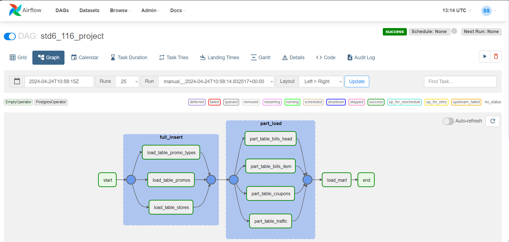

# Overview


This is a project within the course "Analytics and working with data" from **Sapiens Solutions**.

## Solved tasks:

* Creating dimension and fact tables in **Greenplum** with setting up data *distribution* and *partitioning*
* Uploading data from external sources (*PostgreSQL* tables, *CSV* files) into **Greenplum** using various protocols (**pxf**, **gpfdist**)
* Creating data mart in **Greenplum** and uploading it into **Clickhouse**
* Orchestration of uploading data from external sources and creating a data mart in *Greenplum* using **Apache Airflow**
* Creating a dashboard in **Apache Superset** based on data mart from *Clickhouse*

## Stack

* 🗄️ Greenplum
* 🗄️ PostgreSQL
* 🗄️ Clickhouse
* 🔄 Apache Airflow
* 📊 Apache Superset

## Initial data

|   **Name**    | **Technical name** | **Description** |
| :-----------: | :---------------:| :-----------: |
| Магазины    | stores         |Table of texts for stores. This table must be loaded from a file via ***gpfdist*** from the local machine             |   
| Трафик      | traffic           |Information about customers entering the store. This table must be loaded from an external PostgreSQL database via ***PXF***|
|Чеки |bills_head, bills_item|Bills data. Stored in two separate tables gp.bills_head and gp.bills_item. These tables must be loaded from an external PostgreSQL database via ***PXF***|
|Купоны|coupons|Information about discount coupons. Registration of the coupon by the seller occurs at the moment the coupon is presented by the buyer. Each coupon goes into a specific receipt without reference to a position. One coupon allows you to apply a discount on one unit of goods. Each coupon applies to a specific promotion. checking for the impossibility of punching more coupons than amount of products in the bill is performed at the moment the check is punched. This table must be loaded from a file via ***gpfdist*** from the local machine|
|Акции|promos|A list of current promotions in the company at the time of writing the report. This table must be loaded from a file via ***gpfdist*** on the local machine|
|Тип акции|promo_types|A list of current types of shares in the company at the time of preparation of the report. This table must be loaded from a file via ***gpfdist*** from the local machine|

# Setting up gpfdist

* **[-d directory]** – directory with files
* **[-p http_port]** – listening port (default **8080**)
* **[-P last_http_port]** – iterate ports up to this value in case the listening port is busy
* **[-l log_file]** – log output (stdout)
* **[-t timeout]** – timeout for establishing a connection with Greenplum (default 5 seconds)
* **[-S]** – synchronous writing to disk without using cache
* **[-w time]** – waiting before closing file for writing (default **0**)
* **[-v | -V]** – verbose | Very verbose - detailed mode showing progress and status messages | showing all output messages
* **[-s]** – simplified logging, only WARN and ERROR
* **[-m max_length]** - maximum length of one data line in bytes (default **32768**)
* **[--ssl certificate_path]** – adding SSL encryption to data transferred via gpfdist
* **[--sslclean wait_time]** – setting the amount of time the utility delays closing the SSL session and cleaning up SSL resources after finishing writing data to or from a Greenplum database segment (default 0)
* **[-c config.yml]** - specifying the transformation rule that gpfdist uses to select a transformation when loading or retrieving data

## Example

``` gpfdist -d C:\Users\load2gp -p 8080 ```

# Orchestration of uploading data

* Visual representation of created dag



# Data visualisation

[Created dashboard](dashboard.pdf)